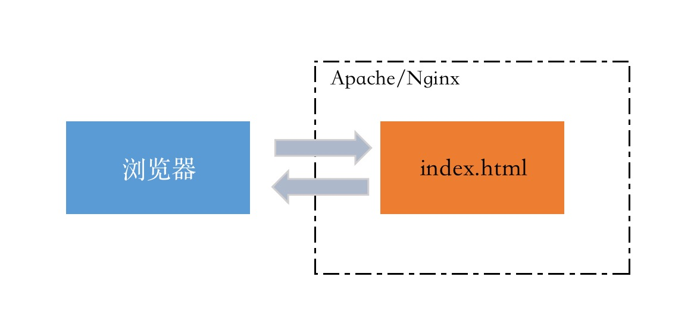
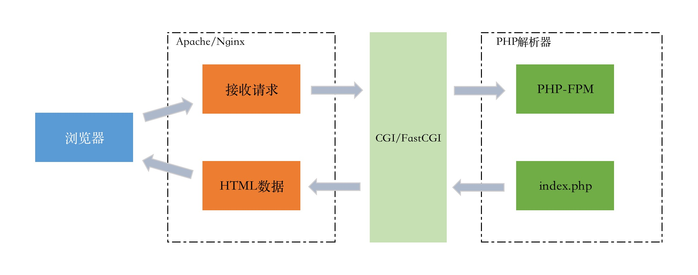
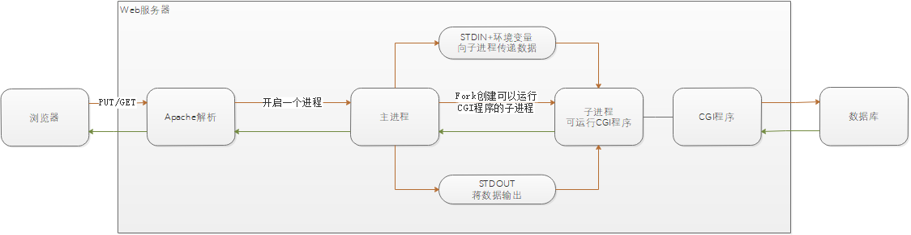
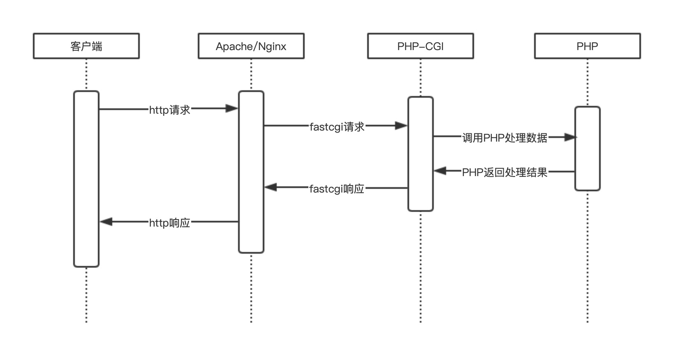

# CGI、FastCGI

搭建LAMP、LNMP服务器时，总会遇到PHP-FPM、CGI、FastCGI这几个概念。

### CGI的来源

在网站的整体架构中，WebServer（如apache、nginx、tomcat）只是内容的分发者，对客户端发来的请求进行响应。

如果客户端请求的是 **index.html** 这类静态页面，那么WebServer就会去文件系统中找对应的文件，找到后，返回给客户端，这里WebServer分发的就是静态资源数据。如图所示：

如果客户端请求的是 **index.php** 这类动态页面，WebServer会根据配置文件判断出这个不是静态文件，这是会调用PHP解析器进行处理，然后将返回的数据转发给客户端。如图所示：

!!! note ""
    WebServer并不能直接处理静态或动态请求，对于静态请求是找到相应的文件然后直接返回；而动态请求是由服务器交由其它的工具进行处理，如PHP解析器。
    

### 关于CGI

CGI，全称是通用网关接口。是Web服务器和一个客户端进行通信的协议。

CGI可以用任何一种具有标准输入输出和环境变量的语言编写，例如perl、python、C/C++、PHP等。

#### CGI工作原理

web服务器可以直接处理静态请求，如果是动态请求，web服务器主进程会Fork创建出一个新的进程来启动CGI程序，也就是将动态请求交由CGI程序来处理。

启动CGI需要有一个初始化过程，读取配置、加载扩展等等，CGI程序启动后会去解析这些动态请求，然后将结果返回给web服务器，最后由web服务器将结果返回给客户端，前面Fork的进程也会随之关闭。

!!! note ""
    每次用户的动态请求，web服务器都会重新Fork创建新进程，然后去启动CGI程序来处理动态请求，处理完成后再关闭，效率非常低。

#### PHP-CGI

前面也说了，CGI是一种协议，那么PHP语言对CGI接口规范的实现也就是PHP-CGI，也叫PHP解析器。随着业务的发展，PHP-CGI的性能问题逐渐暴露。
PHP在运行时是依赖加载配置文件php.ini的，所以每次PHP-CGI启动的时候，都需要重新加载配置文件并初始化，加载扩展等，造成了很大的资源和时间的浪费。当程序的访问量大时，影响更甚。

FastCGI 是 CGI 的改进版本。FastCGI 可以一直运行，是常驻型的CGI。在请求到达时，不需要耗费时间去Fork创建一个进程来处理，直接使用。

FastCGI的工作流程：

1）Web服务器启动的同时，加载FastCGI进程管理器（例php-fpm）

2）FastCGI进程管理器会去读取php.ini配置文件，对自身进行初始化，并启动多个CGI解析器进程（php-cgi），并等待Web服务器的连接。

3）当客户端请求到达Web服务器时，FastCGI进程管理器选择并连接到一个CGI解释器。Web服务器会将CGI环境变量和标准输入发送到FastCGI子进程php-cgi来进行处理

4）FastCGI子进程完成处理后，将数据按照CGI规定的格式返回给Web服务器，然后关闭FastCGI子进程的连接，FastCGI子进程继续等待下一次请求。
