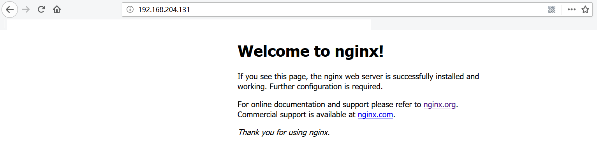

# Docker 安装

!!! note "前提条件"
    本地需要安装有docker环境
    

1）查看可用的Nginx版本，访问 [Nginx 镜像库地址](https://hub.docker.com/_/nginx/?tab=tags)


2）默认用最新版本，也可以根据自己需要选择其它版本。也可以在本地用命令行查询可用版本。

```bash
$ docker search nginx
```


3）拉取最新版的 Nginx 镜像

```bash
$ docker pull nginx:latest
```


4）查看本地镜像

```bach
$ docker images|grep nginx
```


5）运行容器

```bash
$ docker run --name nginx-test -p 8081:80 -d nginx
```

```text
参数说明：

--name nginx-test：容器名称。

-p 8081:80： 端口进行映射，将本地 8081 端口映射到容器内部的 80 端口。可以根据自己情况做调整，建议80对80

-d nginx： 设置容器在在后台一直运行。

```


6）安装成功，打开浏览器，输入：127.0.0.1 或者IP地址，即可看到欢迎页面
       


