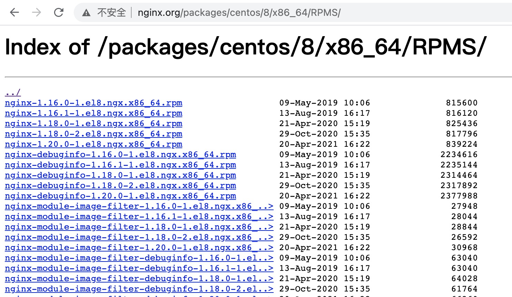

# 普通安装

### Windows安装

1）安装包可以[nginx官网](https://nginx.org/en/download.html)下载。进入官网，选择合适版本（nginx/Windows-xxx）。


2）这里选择的是nginx/Windows-1.19.10，如下图所示：


3）解压到本地，进入目录找到nginx.exe，直接启动


4）可以针对nginx.exe创建快捷方式，方便启动。


### Linux 安装

#### 1、rpm 包方式（推荐）

1）进入[下载页面](http://nginx.org/packages/)，选择合适版本下载。



```bash
$ wget http://nginx.org/packages/centos/8/x86_64/RPMS/nginx-1.16.0-1.el8.ngx.x86_64.rpm  
```


2）安装 nginx rpm 包

nginx rpm 包实际上安装的是 nginx 的 yum 源。

```bash
$ rpm -ivh nginx-*.rpm
```


3）正式安装 rpm 包

```bash
$ yum install nginx
```


4）关闭防火墙

```bash
$ firewall-cmd --zone=public --add-port=80/tcp --permanent
$ firewall-cmd --reload
```


#### 2、源码编译方式

##### 安装编译工具及相关库

!!! note "Nginx 源码的编译依赖于 gcc 以及一些库文件，所以必须提前安装。"
    ```bash
        $ yum -y install make zlib zlib-devel gcc-c++ libtool openssl openssl-devel
    ```


Nginx 依赖 pcre 库，安装步骤如下：

1）下载解压到本地

进入[pcre 官网下载页面](https://sourceforge.net/projects/pcre/files/pcre/)，选择合适的版本下载。

我选择的是 8.44 版本：

```bash
wget -O /opt/pcre/pcre-8.44.tar.gz https://sourceforge.net/projects/pcre/files/pcre/8.44/pcre-8.44.zip/download
cd /opt/pcre
tar zxvf pcre-8.44.tar.gz
```


2）编译安装

执行以下命令：

```bash
cd /opt/pcre/pcre-8.44
./configure
make && make install
```


3）检验是否安装成功

执行 `pcre-config --version` 命令。


##### 编译安装 Nginx

安装步骤如下：


1）下载解压到本地

进入官网下载地址：http://nginx.org/en/download.html ，选择合适的版本下载。

我选择的是 1.19.10 版本：http://nginx.org/download/nginx-1.19.10.tar.gz

```bash
wget -O /opt/nginx/nginx-1.19.10.tar.gz http://nginx.org/download/nginx-1.19.10.tar.gz
cd /opt/nginx
tar zxvf nginx-1.19.10.tar.gz
```


2）编译安装

执行以下命令：

```bash
cd /opt/nginx/nginx-1.19.10.tar.gz
./configure --with-http_stub_status_module --with-http_ssl_module --with-pcre=/opt/pcre/pcre-8.44
make && make install
```


3）关闭防火墙

```bash
$ firewall-cmd --zone=public --add-port=80/tcp --permanent
$ firewall-cmd --reload
```


4） 启动 Nginx

安装成功后，直接执行 `nginx` 命令即可启动 nginx。启动后，访问站点：


### MacOS安装

#### brew安装

1）前提条件，需要安装有brew工具。如果没有brew，自行查询安装方式。


2）在命令行输入安装命令，默认安装最新版本

```bash
$ brew install nginx
```


3）启动
```bash
$ brew services start nginx
```


4）打开浏览器，输入：127.0.0.1 或者IP地址，即可看到欢迎页面

