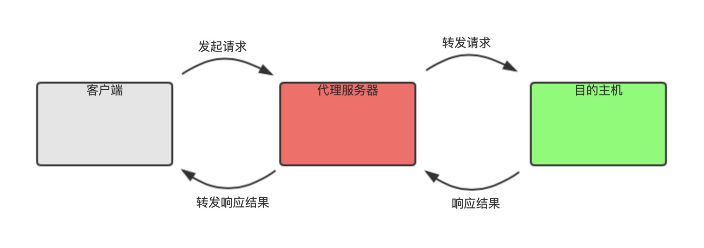
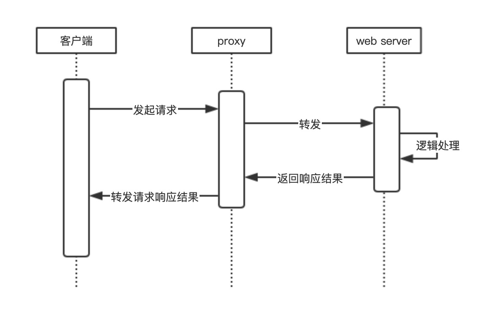

# 代理服务器

## 什么是代理服务器

客户端在发送请求时，不会直接发送给目的服务器，而是先发送给一个特殊的服务器代为中转，也就是代理服务器。

代理服务接受客户端发来的请求后，再向实际的目的主机发出，并接收目的主机返回的数据，存放在代理服务器的硬盘中，再发送给客户机。

## 作用

* 1）提高访问速度

目标主机返回的数据会存放在代理服务器的硬盘中，所以，下一次的客户端请求相同的站点数据时，会直接从代理服务器中的硬盘中读取，也就是缓存的作用，可以明显提高请求速度。

* 2）防火墙作用

客户端的请求都会经过代理服务器，所以可以在代理服务器上设置权限、过滤不安全的信息

* 3）通过代理服务器访问不能访问的目标站点

某些目标站点不能在客户端访问，可以在不受限制的代理服务器上访问。客户端访问代理服务器，代理服务器转发到目标站点。翻墙浏览器使用的就是代理服务器原理。