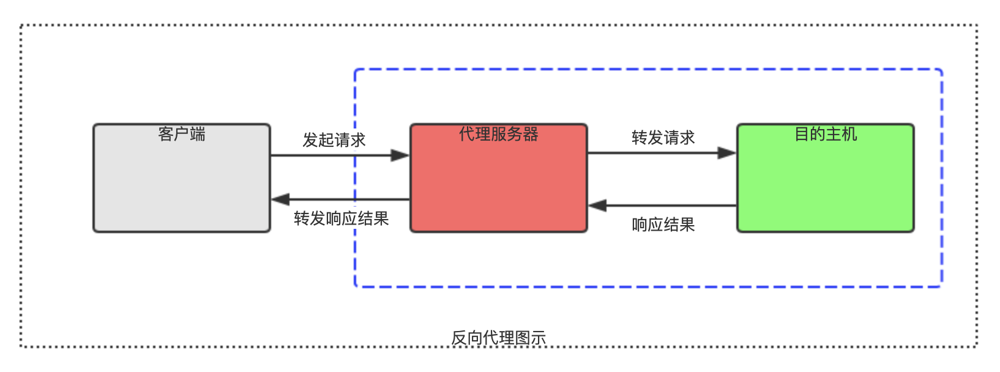

# Http反向代理


## 正向代理

代理访问外部资源，可以理解成客户端的一个跳板机。

比如国内访问Twitter，客户端直接访问是不行的，那么，通过一个正向代理服务器来访问。

把请求发到代理服务器，并且代理服务器是能够访问，由代理去请求访问并且把数据返回给我们，这样就能实现我们访问Twitter。


### 正向代理的作用

* 访问原来无法访问的资源，如twitter、youtube

* 可以做缓存，加快访问速度

* 对客户端进行访问授权、认证

* 记录用户访问记录（上网行为管理）


## 反向代理

反向代理是指，由代理服务器来接收来自客户端的连接请求，然后把请求转发给内部网络上的服务器，并且把服务器上的响应结果返回给客户端，这时的代理服务器对外的表现就是服务器。




### 反向代理的作用

* 保证内网的安全，服务与服务之间只能由内网访问，外网只能访问反向代理服务器。

* 负载均衡，部署多个内部服务器，通过分流减轻负载。


## 总结

正向代理，代理客户端，服务端不知道实际发起请求的客户端

反向代理，代理服务器，客户端不知道实际提供服务的服务端


## 配置反向代理

```text
#设定实际的服务器列表
upstream zp_server1{
    server 192.168.10.110:9606;
}

server {
    # 监听端口 80
    listen  80;

    # 监听域名localhost.test-proxy.com
    server_name localhost.test-proxy.com;

    #反向代理的路径（和upstream绑定），location 后面设置映射的路径
    location / {
        proxy_pass http://zp_server1;
    }

}
```